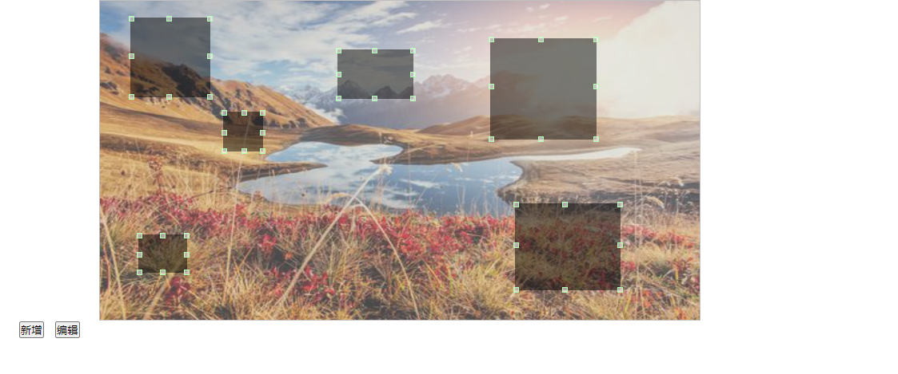

# img-hotspot 插件介绍

```
此插件用途：动态设置可编辑的图片热区，配合后端可动态配置到各类平台。
注意事项：此插件vue2版本插件，暂不支持vue3。
安装需要较高版本npm：6.9.0； node版本： 12.0.0。
```
## 图示

## demo演示
```
http://xujiaerdi.online
```
## 使用
```
npm install img-hotpost

mian.js

import imgHotpost from 'img-hotpost';
Vue.use(imgHotpost)
```

### 启动
```
npm run serve
```
### 参数说明

```
      mode: "",   // "isAdd" 新增热区；"isEdit" 编辑热区、只可拖放；默认不填、不填则为默认图片样式
      options: {
        width: 750, // 图片容器宽度
        height: 400, // 图片容器高度
        icon: require("../assets/timg.jpg"),    // 图片
        maskList: [ // 热区数组
          {
            width: 100, // 热区宽度
            height: 100,    // 热区高度
            color: "white", // 热区颜色、此版本不支持
            left: 0,    // 热区横坐标
            top: 0, // 热区纵坐标
            url: "#"    // 热区链接
          },
          {
            width: 50,
            height: 50,
            color: "white",
            left: 200,
            top: 200,
            url: "#"
          }
        ]
      }
```
### 联系方式
```
qq邮箱：172858147@qq.com
wechat: xujiaerdi
```


